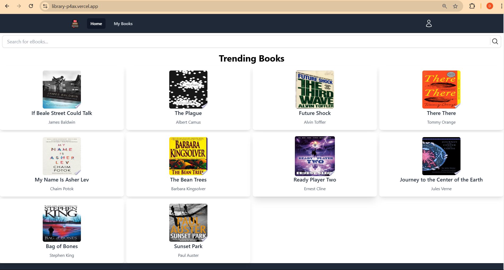
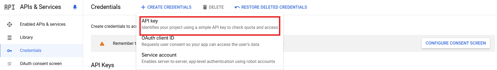

# eBook Finder Project

This project provides an online platform for discovering and reading eBooks using the Google Books API. The project is divided into two parts: the **Frontend** (React-based interface) and the **Backend** (Node.js server).

- **Frontend**: Allows users to search for eBooks, view book details, and manage favorites.
- **Backend**: Fetches eBook data from the Google Books API and serves it to the frontend.

## Table of Contents

1. [Environment Setup](#environment-setup)
2. [Frontend Setup](#frontend-setup)
3. [Backend Setup](#backend-setup)
4. [Clone the Repository](#clone-the-repository)

## Environment Setup

### 1. Google Books API Key

To use the Google Books API, you need an API key. Here’s how you can obtain it:

#### Steps to get Google Books API key:

1. Go to the [Google Cloud Console](https://console.cloud.google.com/).
2. Create a new project or select an existing project.
3. Go to **APIs & Services** > **Library**.
4. Search for **Google Books API** and enable it for your project.
5. Go to **APIs & Services** > **Credentials**.
6. Click **Create Credentials** > **API Key**.
7. Copy the API key generated.

### Clone the repository:

    git clone https://github.com/Divij35/Library.git

### Frontend Setup

In the frontend, you’ll need to set up the Google Books API key to enable data fetching from the API.

#### Frontend API Setup

    cd frontend

1. Install dependencies:

       npm install  

1. Running the frontend

        npm run start

1. Environment variable
Create .env file in the frontend folder

        VITE_BACKEND_URL=http://localhost:5000

### Backend Setup
    cd frontend

1. Install dependencies:

       npm install  

1. Running the frontend

        npm start

1. Environment variable
Create .env file in the frontend folder

        NODE_ENV=development
        VITE_API_KEY = YOUR_BOOK_API
        VITE_URI = http://localhost:5173/
